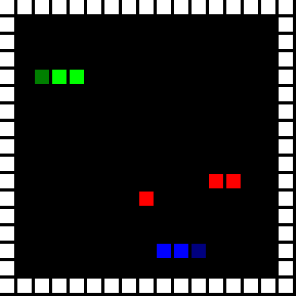

# OpenAI Requests For Research 2.0 Slitherin

Research for improving self-play instability

# Requirements
Trarning is done using tensorflow-gpu == 1.13.1, and the environment only needs to import the uploaded multi_snake.py.

# Research Introduction
The uploaded code is the first of the seven research requirements submitted from https://openai.com/blog/requests-for-research-2/.

⭐⭐ <strong>Slitherin'.</strong> Implement and solve a multiplayer clone of the classic <a href="https://www.youtube.com/watch?v=wDbTP0B94AM">Snake</a> game (see <a href="https://slither.io">slither.io</a> for inspiration) as a <a href="https://github.com/openai/gym">Gym</a> environment.

<ul>
<li>Environment: have a reasonably large field with multiple snakes; snakes grow when eating randomly-appearing fruit; a snake dies when colliding with another snake, itself, or the wall; and the game ends when all snakes die. Start with two snakes, and scale from there.</li>
<li>Agent: solve the environment using self-play with an RL algorithm of <a href="https://blog.openai.com/competitive-self-play/">your</a> <a href="https://deepmind.com/blog/alphago-zero-learning-scratch/">choice</a>. You'll need to experiment with various approaches to overcome self-play instability (which resembles the instability people see with GANs). For example, try training your current policy against a distribution of past policies. Which approach works best?</li>
<li>Inspect the learned behavior: does the agent learn to competently pursue food and avoid other snakes? Does the agent learn to attack, trap, or gang up against the competing snakes? Tweet us videos of the learned policies!</li>
</ul>

# Single Agent Warm-Up
Before playing multiple snake games, I first solved a single snake game on dqn, but was able to tweet and generate decent results.

Sigle Agent Result video : https://twitter.com/kimbring2/status/963671596610326528

# Reference
In this research, there was no given code for environment and algorithm, so I need to create and find a multi-agent snake game and self-play algorithm. Many excellent other researchers have published environment and algorithm on github, so I can use them as a reference to conduct research presented by OpenAI.

1. https://github.com/yenchenlin/DeepLearningFlappyBird - Single DQN
2. https://github.com/bhairavmehta95/slitherin-gym - Multi Snake Env
3. https://github.com/ingkanit/multi-snake-RL - PPO2 for Multi Snake playing
4. https://web.stanford.edu/~surag/posts/alphazero.html - Self Play Algorithm

Once again, thanks for these researchers.

# Experiment Setting
The experiment first targeted two snakes. The height and width of env is 15x15. In addition to the current state, the previous three states can be used together, so that in addition to the snake position information, direction information can be grasped together by a network. Each snake can move up, down, right, left, and put 3 fruits that can earn 1 reward upon acquisition for each episode. Here snakes must compete with each other and get the maximum reward without crossing to the edge.

The DQN network uses a structure like Double-Dueling-DQN (https://github.com/awjuliani/DeepRL-Agents/blob/master/Double-Dueling-DQN.ipynb) raised by Arthur Juliani. The CNN kernel size and the number of filters were slightly adjusted and the rest were used as is.

| Network Structure | Value |
| ------------- | ------------- |
| CNN Policy Layer 1 | num_outputs=16, kernel_size=[3,3], stride=[1,1] |
| CNN Policy Layer 2 | num_outputs=32, kernel_size=[3,3], stride=[1,1] |
| CNN Policy Layer 3 | num_outputs=32, kernel_size=[3,3], stride=[1,1] |
| Dueling DQN Layer | Divide output of CNN Policy Layer 3 by axis 3 into two stream |
| Advantage Layer | Faltten of first stream of Dueling DQN, xavier_initialization, size=[1296, 4] |
| Value Layer | Faltten of second stream of Dueling DQN, xavier_initialization, size=[1296, 1] |
| Current Q | Value + (Advantage - Mean of Advantage) |
| Target Q | Reward + (Discount factor * Double Q * Done) | 
| TD Error | Target Q - Current Q |
| Loss | Reduce mean of TD Error |

In order to apply the Self-Play algorithm to DQN, I create two buffer that store agent trajectory, which is different from the single agent DQN. If two snakes die while recording all the state, action, reward, and done information of two snakes from the episode, train the network with the data of the remaining snake until the end. And the number of episode limit steps In the case of ending beyond, I just select one at randomly among two buffer.

| Traning Parameter | Value | Details |
| ------------- | ------------- | ------------- |
| batch_size  | 512 | How many experiences to use for each training step |
| update_freq  | 4  | How often to perform a training step |
| startE  | 1  | Starting chance of random action |
| endE  | 0.1  | Final chance of random action |
| y  | .99  | Discount factor on the target Q-values |
| annealing_steps  | 100000  | How many steps of training to reduce startE to endE |
| num_episodes  | 100000  | How many episodes of game environment to train network with |
| max_epLength  | 200  | The max allowed length of our episode |
| pre_train_steps  | 10000  | How many steps of random actions before training begins |
| h_size  | 1296*2  | The size of the final convolutional layer before splitting it into Advantage and Value streams |
| tau  | 0.001  | Rate to update target network toward primary network |

# Single Snake Experiment Result
| Paramter | Result video |
| ------------- | ------------- |
| annealing_steps : 500000, num_episodes : 500000, pre_train_steps : 50000, startE : 0.1, endE : 0.0001 | |

# Multi Snake Experiment Result
| Paramter | Result video |
| ------------- | ------------- |
| annealing_steps : 100000, num_episodes : 100000, pre_train_steps : 10000, startE : 0.1, endE : 0.0001 |  |
| annealing_steps : 500000, num_episodes : 500000, pre_train_steps : 50000, startE : 0.1, endE : 0.0001 |   |
| annealing_steps : 5000000, num_episodes : 5000000, pre_train_steps : 50000, startE : 0.1, endE : 0.0001 |   |

